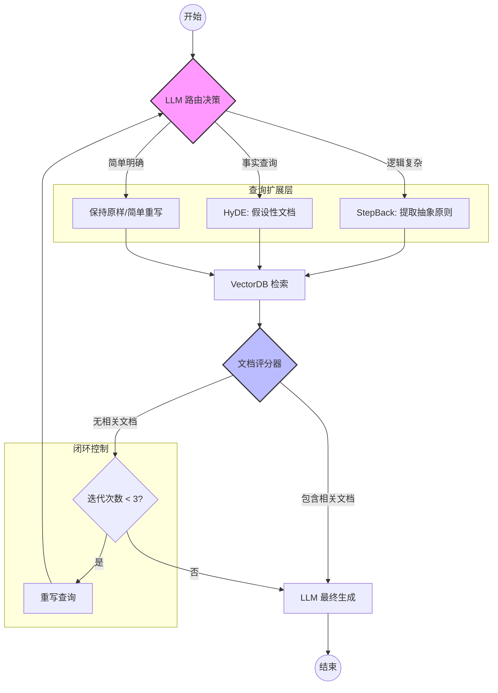

langChain 1.x  1.抽象统一化，收敛核心概念，简化开发;
2.统一使用 create_agent，底层由 LangGraph 驱动，一行代码即可完成复杂功能 ;
3.原生支持状态管理、循环、分支和持久化，让代理具备企业级韧性;
4.引入 content_blocks 标准属性，将文本、工具调用、图片等输出统一为类型化块，切换模型成本趋近于零;
5.由 LangGraph 的检查点（Checkpointer）机制统一处理，能保存和恢复完整的对话状态，更强大和通用
6.核心抽象进一步精简，旧版 Agent 执行器和部分模块被移至 langchain-legacy 以保持兼容

langChain 0.3
1.核心哲学	功能模块化，提供多种选择
2.Agent构建方式	存在多种代理类型（如initialize_agent），API 多样
3.底层引擎	基于 AgentExecutor
4.模型输出	不同模型返回格式各异，需要自行解析
5.记忆机制	各类专门的 Memory 类	
6.包结构	部分工具和集成在 langchain-community 中

## reRat、ToT、Plan-and-Solve、GoT
reRat 思考-行动-观察 简单 （联网搜索）

Plan-and-Solve 规划-执行 （长文写作）

ToT 多路径探索与回溯  （数学证明、复杂代码）

GoT 有向图（Directed Graph）可以合并、回溯、循环 复杂

## RAG BM25算法
属于稀疏检索
一个文档与查询的相关性，取决于查询词项在文档中出现的频率、文档的长度，以及整个文档集合中该词项的稀有程度
tf-idf（词频）算法的升级。比tf-idf的优点是不会无限增大，词频会出现饱和，文档长度会归一化


## RAG流程
1.查询转换和处理 （意图识别、查询改写/拓展）HyDE策略(通过LLM 假设一个答案，假设答案转成向量和库中数据比对)  Step-Back 策略（用户意图不明先抽象再检索）

2.检索阶段 (Retrieval) 多路召回（稀疏索引（embdding模型）、稠密索引）之后根据余弦相似度返回 Top-K，然后进行重排(rerank，rerank模型)

3.提示词注入 

4.模型生成后处理


## rag类型
1. 基础RAG 向量检索+生成
2. 多模态RAG
3. HyDERAG 假设文档
4. 纠错RAG 会自动纠错 不能出错的场景
5. 图谱RAG 知识图谱RAG
6. 混合RAG 向量+关键词
7. 自适应RAG 简单问题直接答 复杂问题走agemt
8. 智能体RAG
9. 自反思RAG 自己判断是否需要检索还是输出答案

## RAG如果有噪声怎么办？
噪声分类
### 知识库层面
  1.内容错误 2格式错  3质量低 4.冗余/重复文档
### 检索层面
  1.不相关 2部分相关 3排序偏差 4 召回缺失
### 生成层面
  1.上下文过载 2位置偏差 3幻觉放大 4.忠实度不足
### 解决方案
  一、知识库 1.文档预处理清洗 2.质量评分机制 3.实体交叉验证   
  二、检索  1.混合检索 2.相似度阈值过滤3.查询扩展与改写  
  三、排序  1.cross-encoder 重排序（BAAI/bge-reranker-v2-gemma） 2.MMR重排(贪心) 3.一致性验证
  四、生成  1.上下文压缩  2.分布验证（self-RAG） 3.多文档投票
  五、评估  检索噪声率 事实准确率 矛盾检出率 幻觉率


## RAG 范式
  1. 高级RAG:
    - 检索前优化： 改写查询、路由
    - 检索中优化: 混合检索（用户查询->关键词、向量检索->RRF、加权和、学习排序->重新排序**Cross-encoder**/mmr多样性排序）、重排序rerank
    - 检索后优化: 上下文压缩、摘要
  1. 模块化RAG
    - 自适应adaptiveRAG：判断复杂度根据不同复杂度制定
    - 迭代检索RAG 多伦检索逐步晚上
    - 递归检索RAG 分块后 层次化检索一层知识再递归
    - 多跳RAG  多步推理的复杂查询。通过检索中间信息，逐步"跳跃"到最终答案。
    - self-RAG   LLM 自我评估检索是否需要重新检索修正
  1. 前沿  agenticRAG
    - 规划-执行-验证循环  规划 → 执行 → 验证 → 迭代
    - 工具调用
    - 多智能体协作

## RAG检索 评估
 寻找**成本-效果-延迟**的平衡点

### 检索部分
使用的度量指标包括

1.**召回率**(Recall，检索到的文档/数据库中文档)、

2.**精确率**(Precision。检索到的相关文档/检索到的全部)

3.**调和平均值**（调和召回率和精确率）（如F1分数、Fβ分数）、

4.**平均精确率**（多个查询的精确率平均值）(Mean Average Precision，MAP)

5.**平均倒数排名**（估检索系统将第一个相关文档排在搜索结果前列的能力）(Mean Reciprocal Rank，**MRR**)；
针对不同的场景对于不同的指标是不同的。对于金融相关的场景 精确度往往比召回率权重要高，对于医疗等场景则是不能遗漏，所以召回率权重更高

### 生成部分
1.**答案相关性**

2.**答案真实性**

3.**忠实度** 是否忠实于提供的上下文信息  1.人工评估  2.自动检查过程 通过评估模型  3.基于大语言模型 4.基于大语言模型

### RAG评估框架
1.TruLens框架 引入了一种名为“反馈函数”的特性，它允许我们以编程方式评估大语言模型应用的输入、输出和中间结果的质量

2.RAGAs框架 RAGAs主要评估两个核心组件——检索器和生成器，并提供了多种量化指标来衡量它们的表现。在评估RAG流程时，RAGAs需要以下输入：question（用户查询问题）、answer（问题答案）、context（相关上下文）和ground_truth（标准答案）。

3.LlamaIndex评估

4..LangSmith评估

5.**DeepEval** 测试用例的形式：
几个关键方面：❍ 幻觉：量化模型在生成过程中可能出现的不真实陈述，以确保输出的可靠性。❍ 偏见：评估模型输出中可能存在的偏见，确保模型的公平性。❍ 毒性：检测模型输出中是否包含攻击性、讽刺或威胁性内容，以确保语言的文明性。❍ 知识保留：评估模型在处理信息时能否保持知识的完整性和持久性。❍ 摘要：衡量模型生成的摘要是否有效，以及能否准确概括关键信息。❍ G-Eval：一个基于大语言模型和思维链的评估框架，允许根据自定义标准对LLM的输出进行评估。

### 评价embdding模型
	1.性能： 1向量维度数量 2序列长度（上下文token） 3.推理延迟
	2.语义适配 1.语言支持 训练领域
	3.评估指标（重要）召回率 MRR(平均倒排名)
	4.公认基准 MTEB C-MTEB
	

### langgraph
问题是那种文档格式的数据
```
### 角色
你是一个高精度的金融语义分析专家，负责为 RAG 系统选择最匹配的检索增强策略。

### 策略定义
1. **StepBack (回退提问/抽象原则)**：
   - 场景：涉及宏观经济政策影响、监管合规逻辑、资产配置原理、跨行业对比。
   - 特征：问题包含特定实体，但需要底层金融逻辑支撑。
   - 示例："巴塞尔协议III对中小商业银行流动性的具体影响？"

2. **HyDE (假设性文档/事实检索)**：
   - 场景：涉及具体金融产品定义、财务指标计算公式、特定历史行情事件描述、公告事实。
   - 特征：问题目标明确，但向量库中可能存在多种表述，需要模拟标准答案来对齐语义。
   - 示例："什么是转融通业务中的约定申报？"

3. **Direct (直接检索)**：
   - 场景：简单名词解释或宽泛的行业通识。

### 任务
分析用户问题，必须输出以下 JSON 格式：
{
  "analysis": "简述问题的金融维度（宏观原则 vs 具体事实）",
  "strategy": "stepback" | "hyde" | "direct",
  "confidence": 0.0-1.0
}
```



## 如何设计Agent的记忆写入机制
1.三维度漏斗筛选 持久化、结构化、个性化

2.GraphRAG  向量检索+ 知识图谱（解决多跳推理问题）

3.动态反思，周期性自我提问和总结

4.冷热分级存储

## 生命周期监控体系
1.可观测性  利用tracing链路追踪 （初次召回结果、检索模型、候选召回数、哪一层检索、路由决策、是否重写、耗费时长、文档得分、重排得分、使用到的functool、输入输出token、用户session）

2.精确监控input、output Token，设置熔断机制，防止死循环或攻击

3.质量归因：区分性能还是质量，引入 MBE评分 利用更高阶的模型（如 GPT-4o 或 Claude 3.5 Sonnet）作为裁判


## 设计长期记忆
1.分层存储： 事实存数据库，语境存向量，最近存token
2.Embedding语义搜索 rerank重排 海量历史取数据
3.动态更新

## RAG优化
1.数据提取 去除乱码和噪音
2.智能分块 语义切分、父子文档


## 重排序rerank
通过 query和doc 进行token级别交互 精准捕捉否定词因果关系等。缺点是延时高、必须实时推理
