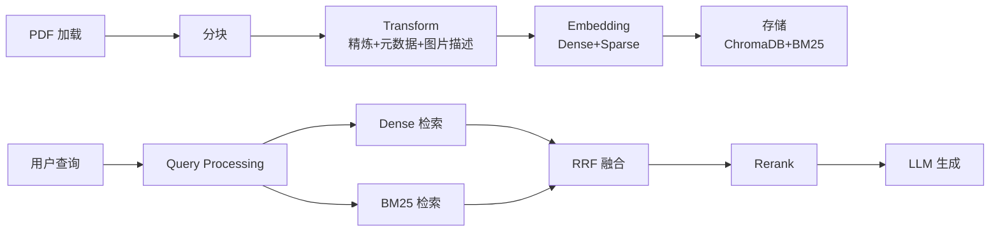
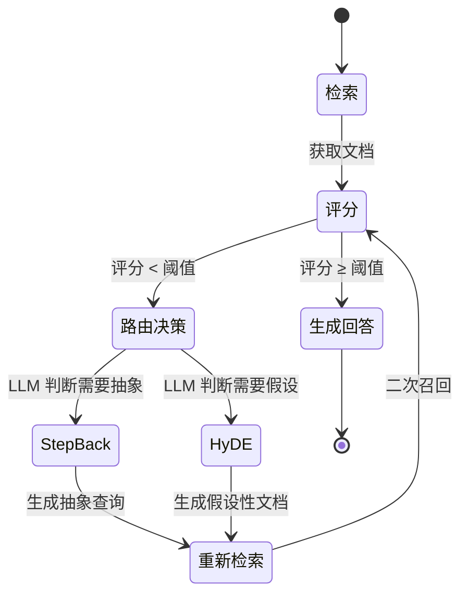

# 🗺️ 金融 RAG 项目学习路线图

> 基于你的项目描述与 MODULAR-RAG-MCP-SERVER 现有代码的对照分析，帮你理清「哪些能直接学、哪些需要扩展、按什么顺序学」。

---

## 一、你的项目 vs 现有代码：对照表

| 你的项目特性 | 现有代码对应 | 差距 & 需要额外学习的 |
|---|---|---|
| **三级层次化分块**（叶子 300 字 → 父块 1200 字） | [document_chunker.py](file:///d:/rag/MODULAR-RAG-MCP-SERVER/src/ingestion/chunking/document_chunker.py) — 单层 `RecursiveCharacterTextSplitter` | ❌ 需自建父子文档索引结构 |
| **Milvus 稠密 + BM25 稀疏双路检索 + RRF** | [hybrid_search.py](file:///d:/rag/MODULAR-RAG-MCP-SERVER/src/core/query_engine/hybrid_search.py) + [fusion.py](file:///d:/rag/MODULAR-RAG-MCP-SERVER/src/core/query_engine/fusion.py) — ChromaDB Dense + BM25 Sparse + RRF ✅ | ⚠️ 向量库从 ChromaDB → Milvus |
| **LangGraph 多智能体状态机**（检索-评分-重写-检索闭环） | 无对应 | ❌ 需全新构建 |
| **Step-Back / HyDE 查询扩展** | [query_processor.py](file:///d:/rag/MODULAR-RAG-MCP-SERVER/src/core/query_engine/query_processor.py) — 基础关键词提取 | ❌ 需扩展 |
| **Cross-Encoder / LLM Rerank** | [reranker.py](file:///d:/rag/MODULAR-RAG-MCP-SERVER/src/core/query_engine/reranker.py) + [libs/reranker/](file:///d:/rag/MODULAR-RAG-MCP-SERVER/src/libs/reranker/) — 框架已有 ✅ | ⚠️ 需下载模型并测试 |
| **Ragas 评估 + 语义监控** | [ragas_evaluator.py](file:///d:/rag/MODULAR-RAG-MCP-SERVER/src/observability/evaluation/ragas_evaluator.py) ✅ | ⚠️ 需实际跑通 |
| **全链路追踪** | [trace/](file:///d:/rag/MODULAR-RAG-MCP-SERVER/src/core/trace/) + [dashboard/](file:///d:/rag/MODULAR-RAG-MCP-SERVER/src/observability/dashboard/) ✅ | ✅ 现有可直接学习 |
| **1200+ 测试用例** | [tests/](file:///d:/rag/MODULAR-RAG-MCP-SERVER/tests/) — 三层测试体系 ✅ | ✅ 学习测试设计思路 |

---

## 二、推荐学习顺序（4 个阶段）

### 阶段 1：吃透现有基础 ⏱ 1-2 周

**目标**：理解标准 RAG 全链路，这是你项目的骨架。



**具体步骤**：

1. **先跑通**：用 Setup Skill 配置好环境，摄取一份金融 PDF，从 Dashboard 观察完整流程
2. **读 Ingestion Pipeline**：[pipeline.py](file:///d:/rag/MODULAR-RAG-MCP-SERVER/src/ingestion/pipeline.py)（6 阶段流水线，583 行），重点理解：
   - SHA256 幂等校验如何避免重复处理
   - Chunk Refiner / Metadata Enricher / Image Captioner 三种 Transform 的设计
   - Dense + Sparse 双编码器怎么并行处理
3. **读 Hybrid Search**：[hybrid_search.py](file:///d:/rag/MODULAR-RAG-MCP-SERVER/src/core/query_engine/hybrid_search.py)（797 行），重点理解：
   - 并行检索 + Graceful Degradation（一路失败自动降级到另一路）
   - RRF 融合算法公式：[score(d) = Σ 1/(k + rank(d))](file:///d:/rag/MODULAR-RAG-MCP-SERVER/src/core/query_engine/fusion.py#287-314)
   - 后置 metadata filter 的设计思路
4. **读配置驱动设计**：[settings.yaml](file:///d:/rag/MODULAR-RAG-MCP-SERVER/config/settings.yaml) + [settings.py](file:///d:/rag/MODULAR-RAG-MCP-SERVER/src/core/settings.py) — 理解工厂模式如何实现零代码切换 Provider

> [!TIP]
> **面试关键**：这一阶段覆盖了 80% 的 RAG 面试问题。确保能回答：「BM25 和 Dense 各自解决什么问题？为什么要 RRF 融合？工厂模式怎么实现的？」

---

### 阶段 2：扩展分块与检索 ⏱ 1-2 周

**目标**：实现你简历中的「三级层次化分块」和「父子文档检索」。

**2.1 三级层次化分块**

现有 [document_chunker.py](file:///d:/rag/MODULAR-RAG-MCP-SERVER/src/ingestion/chunking/document_chunker.py) 是单层分块。你需要扩展为：

```
Document（全文）
  └─ Section（1200 字，父块）
       └─ Paragraph（300 字，叶子块，用于检索）
```

**学习路径**：
- 先理解现有 `DocumentChunker.split_document()` 的 ID 生成和 metadata 继承逻辑
- 学习 LangChain 的 `ParentDocumentRetriever` 设计思路
- 在 `src/ingestion/chunking/` 下新增 `hierarchical_chunker.py`
- 核心：叶子块 metadata 中记录 `parent_id`，检索命中叶子块后向上合并父块

**2.2 向量库替换（ChromaDB → Milvus）**

现有 [vector_store/](file:///d:/rag/MODULAR-RAG-MCP-SERVER/src/libs/vector_store/) 使用工厂模式，扩展非常简单：
- 参考 `chroma_store.py` 的实现
- 在 `src/libs/vector_store/` 下新增 `milvus_store.py`
- 在工厂注册 + `settings.yaml` 添加 Milvus 配置

> [!IMPORTANT]
> 面试高频追问：「为什么选 Milvus 不选 ChromaDB？」→ 答：Milvus 原生支持混合检索（稠密+稀疏在同一索引）、水平扩展、生产级性能，ChromaDB 更适合原型验证。

---

### 阶段 3：构建 LangGraph 多智能体 ⏱ 2-3 周

**目标**：这是你项目中**最有亮点**的部分，也是现有代码中**完全没有**的部分。

**你要实现的状态机流程**：



**学习路径**：

1. **学 LangGraph 基础**：[官方教程](https://langchain-ai.github.io/langgraph/)，重点理解 `StateGraph`、节点、条件边
2. **实现核心节点**：
   - `retrieve_node`：调用现有 `HybridSearch.search()`
   - `grade_node`：LLM 评分，判断文档相关性
   - `route_node`：条件边，决定 Step-Back / HyDE / 直接生成
   - `step_back_node`：让 LLM 将具体问题抽象为一般性原则
   - `hyde_node`：让 LLM 生成假设性文档，再用假设文档做检索
   - `generate_node`：调用现有 `ResponseBuilder` 生成回答
3. **建议位置**：在 `src/` 下新建 `agent/` 目录

> [!TIP]
> **面试亮点说法**：「我们用 LangGraph 构建了有状态的检索流水线，解决了一次检索不够的问题。LLM 自主判断检索质量，不达标则自动触发 Step-Back 或 HyDE 扩展，形成检索-评分-重写-检索的闭环。」

---

### 阶段 4：评估与可观测性 ⏱ 1 周

**目标**：让系统在金融级场景下有「确定性溯源」能力。

**4.1 Ragas 评估**

现有 [ragas_evaluator.py](file:///d:/rag/MODULAR-RAG-MCP-SERVER/src/observability/evaluation/ragas_evaluator.py) 已实现 Faithfulness / Answer Relevancy / Context Precision 三个指标。你需要：
- 准备金融领域的 Golden Test Set（问题 + 标准答案 + 标准上下文）
- 用 [eval_runner.py](file:///d:/rag/MODULAR-RAG-MCP-SERVER/src/observability/evaluation/eval_runner.py) 跑批量评估
- 对比不同策略（纯 Dense vs Hybrid vs Hybrid+Rerank）的指标差异

**4.2 全链路追踪**

现有 TraceContext 已经在 Ingestion 和 Query 两条链路上记录了每个阶段的中间状态。学习重点：
- 读 [trace/](file:///d:/rag/MODULAR-RAG-MCP-SERVER/src/core/trace/) 目录下 TraceContext 的设计
- 理解 `record_stage()` 如何串联整个流水线
- 结合 Dashboard 的 Query Trace 页面观察实际效果

---

## 三、面试准备建议

每学完一个阶段，准备好这些问题的回答：

| 阶段 | 高频面试问题 |
|------|-------------|
| **基础** | BM25 的 TF-IDF 公式？Dense Embedding 的 cosine similarity 原理？RRF 为什么比简单线性加权好？ |
| **分块** | 为什么用层次化分块？叶子块 300 字怎么定的？父子文档怎么合并？ |
| **多智能体** | LangGraph 和普通 Chain 有什么区别？Step-Back 和 HyDE 各解决什么问题？闭环最多重试几次？ |
| **评估** | Faithfulness 怎么计算？如何构建 Golden Test Set？评估指标不好怎么调优？ |

---

## 四、阅读顺序速查表

按这个顺序逐文件阅读，每个文件重点关注注释中标注的设计原则：

| 序号 | 文件 | 核心知识点 | 行数 |
|------|------|-----------|------|
| 1 | [settings.yaml](file:///d:/rag/MODULAR-RAG-MCP-SERVER/config/settings.yaml) | 配置驱动、全局架构总览 | 113 |
| 2 | [types.py](file:///d:/rag/MODULAR-RAG-MCP-SERVER/src/core/types.py) | 核心数据结构定义 | ~300 |
| 3 | [pipeline.py](file:///d:/rag/MODULAR-RAG-MCP-SERVER/src/ingestion/pipeline.py) | 完整 Ingestion 流水线 | 583 |
| 4 | [document_chunker.py](file:///d:/rag/MODULAR-RAG-MCP-SERVER/src/ingestion/chunking/document_chunker.py) | 分块 + ID 生成 + metadata 继承 | 250 |
| 5 | [hybrid_search.py](file:///d:/rag/MODULAR-RAG-MCP-SERVER/src/core/query_engine/hybrid_search.py) | 混合检索 + 并行 + 降级 | 797 |
| 6 | [fusion.py](file:///d:/rag/MODULAR-RAG-MCP-SERVER/src/core/query_engine/fusion.py) | RRF 融合算法 | 314 |
| 7 | [reranker.py](file:///d:/rag/MODULAR-RAG-MCP-SERVER/src/core/query_engine/reranker.py) | 重排 + 回退机制 | 381 |
| 8 | [ragas_evaluator.py](file:///d:/rag/MODULAR-RAG-MCP-SERVER/src/observability/evaluation/ragas_evaluator.py) | Ragas LLM-as-Judge 评估 | 302 |
| 9 | [response_builder.py](file:///d:/rag/MODULAR-RAG-MCP-SERVER/src/core/response/response_builder.py) | LLM 生成 + 引用溯源 | ~300 |
| 10 | [server.py](file:///d:/rag/MODULAR-RAG-MCP-SERVER/src/mcp_server/server.py) | MCP 协议服务端 | ~200 |
